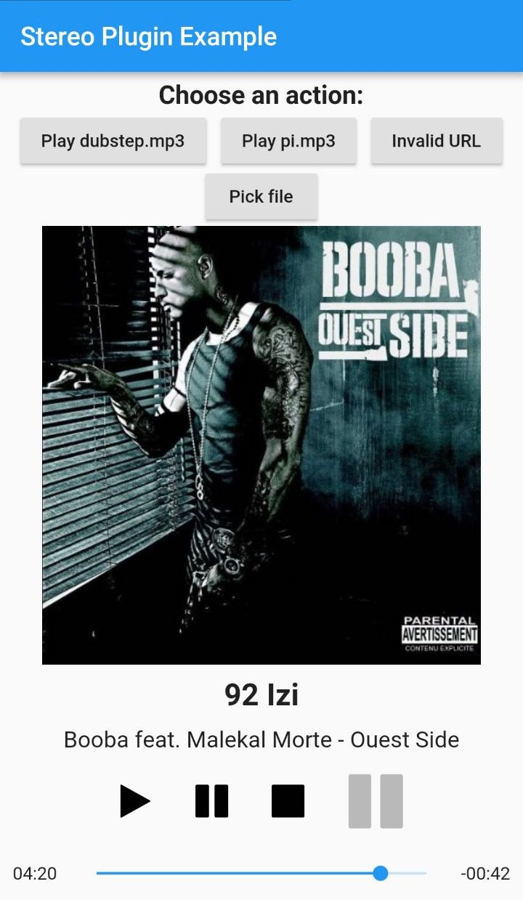

# Stereo plugin for Flutter

A Flutter plugin for playing music on iOS and Android.

## Features

* Play/pause
* Stop
* Duration / seek to position
* Load track from path
* Load track from library

## Installation

First, add `stereo` as a dependency in your `pubspec.yaml` file.

### Android

Add the following permission to your `AndroidManifest.xml` file:
* `<uses-permission android:name="android.permission.READ_EXTERNAL_STORAGE"/>`

### iOS

Add the following key to your `Info.plist` file:
* `NSAppleMusicUsageDescription`

## Example

    

&nbsp;

This example shows how the library works.

* The two buttons *Play dubstep.mp3* and *Play pi.mp3* load a file from the application directory and play them. These files don't have ID3 tags so no information will be displayed.

* The button *Invalid URL* triggers a dialog to inform that the file is not playable.

* The button *Pick file* pops an UI to pick a track from phone's internal storage.

* The buttons at the bottom are controls to play, pause and stop the playback. The fourth button is just there to show the current playback state (playing or not). It's greyed out since no action is bound.

## Changelog

See [CHANGELOG.md](CHANGELOG.md).

## Contributing

Feel free to contribute by opening issues and/or pull requests. Your feedback is very welcome!

## License

This project is licensed under the MIT License. See [LICENSE](LICENSE) file for more information.
