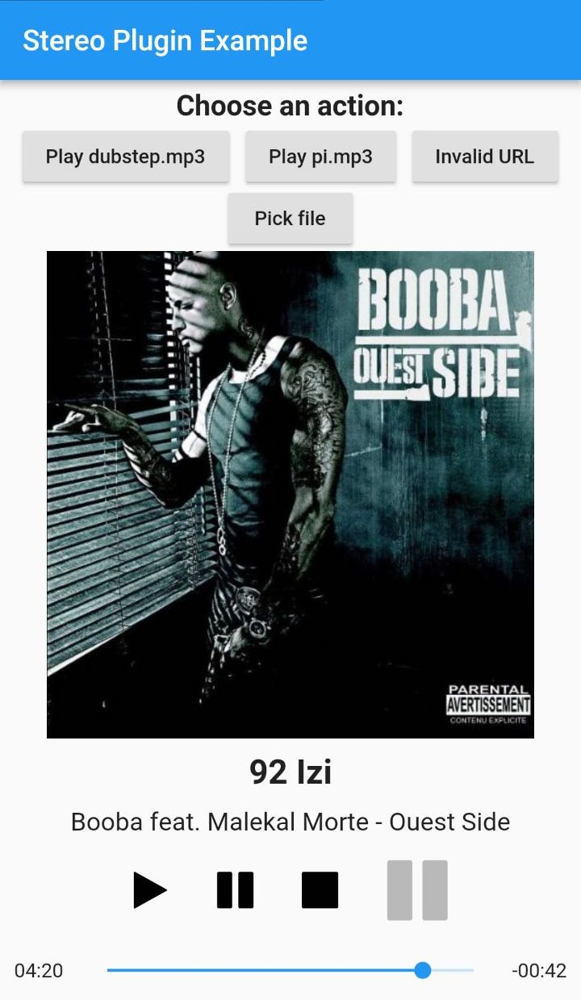

# Stereo Example

    

This example shows how the library works.

* The two buttons *Play dubstep.mp3* and *Play pi.mp3* load a file from the application directory and play them. These files don't have ID3 tags so no information will be displayed.

* The button *Invalid URL* triggers a dialog to inform that the file is not playable.

* The button *Pick file* pops an UI to pick a track from phone's internal storage.

* The buttons at the bottom are controls to play, pause and stop the playback. The fourth button is just there to show the current playback state (playing or not). It's greyed out since no action is bound.
